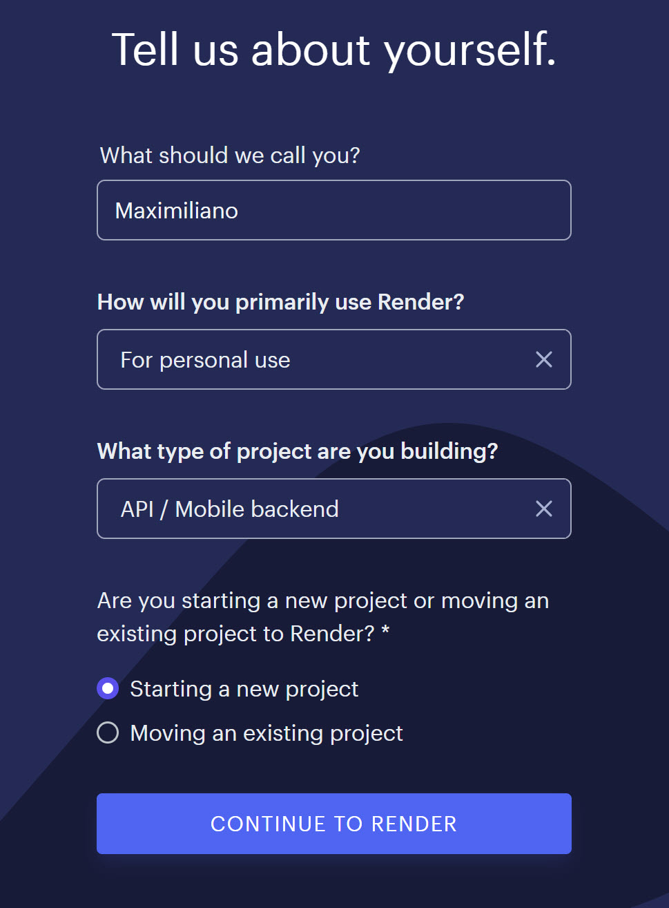

# Inicializando el proyecto


## En el back ejecuto todos estos comandos

```sh
touch server.js README.md .env .env.example .gitignore && mkdir controllers models middlewares data routers public validators

npm init -y && npm i express express-validator mongoose multer cors && npm i nodemon dotenv -D
```

## Levantar el proyecto en el ambiente local (front o back)

1. Bajar el zip (GitHub o Drive)
2. Copian el .env.example
3. Lo renombran a .env
4. Le agregan el puerto. => PORT=8080
5. La URI de DB de MONGO => URI_LOCAL=mongodb://127.0.0.1:27017/bc_ecommerce
5. npm i
6. npm run dev

## Levantar base de datos MONGODB en local

1. Abrir ConEmu
2. Levantar motor de base de datos en una consola => mongod
    Opcional => mongod --dbpath "D:\_courses\63704.bootcamp.fullstack\clase-61\bc63704-integrador-etapa-3\back\data"
3. Conectarse vía mongo shell al servidor en otra consola => mongosh

## Arrancar el proyecto y empezar a desarrollar

1. Abrir Workspace
2. Abrir la consola del back
3. npm i 
4. Abrir conemu
5. Levantar la base de datos (mongod)
6. npm run dev
7. Abrir una consola en el front
8. npm i
9. npm run dev

## Estamos trabajando con el stack MERM


## Subiendo el proyecto a la nube

- [x] Front => Netlify 
- [x] Back => Render
- [x] DB => Mongo Atlas


1. Hacer backup de nuestra base de datos local

> Me posiciono en el directroio donde quiero que se genera la carpeta donde voy a tener los backups de las db de mongo 

```sh
mongodump --db bc_ecommerce
```

2. Hacemos el restore (Recuperamos el backup) en la DB remota

```sh
mongorestore --uri <la-url-que-me-va-a-dar-mongo-atlas> --username <usuario-db> --nsInclude <base-datos>.<collection> <carpeta-donde-están-backups>

mongorestore --uri "mongodb+srv://digitalers.2xyfw8q.mongodb.net/" --username mprincipe --nsInclude bc_ecommerce.* dump
```

3. Subir a Github nuestro backend

4. Loguearse en Render (https://render.com/)

5. Seguir los pasos indicados en la capturas





6. Subir nuestro front a Netlify


